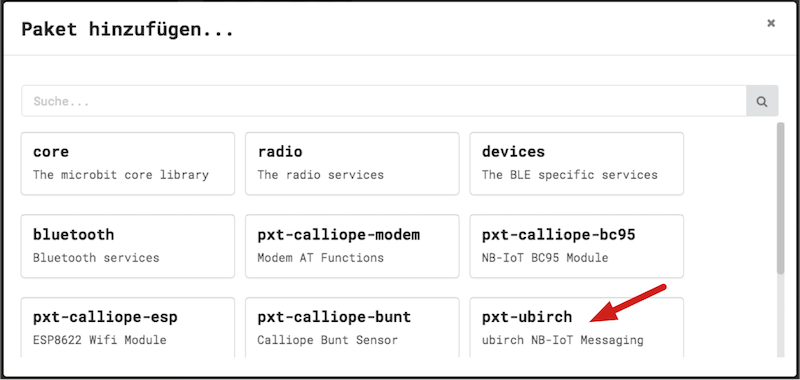

[](https://ubirch.com)

# Calliope mini Entwicklung mit MakeCode (PXT) Editor

1. [Online Editor](#online)
2. [Programme entwickeln und ausführen](#programme-entwicklen-und-ausführen)
    1. [ubirch Editor Paket installieren](#ubirch-erweiterung-installieren)
    2. [Entwickeln von Programmen](#entwickeln-von-programmen)
        1. [Geheimen Schlüssel erzeugen](#geheimen-schlüssel-erzeugen)
        2. [Gerät am Backend anmelden](#gerät-am-backend-anmelden)
3. [Offline Editor Alternative](#offline-alternative)
    
# Online 

Die einfachste Variante mit dem Entwickeln zu starten, ist der online Editor.

> [http://pxt.calliope.cc](http://pxt.calliope.cc)

# Programme entwicklen und ausführen

## ubirch Erweiterung installieren

Bevor das [BC95 Modul](http://www.quectel.com/product/bc95.htm) zusammen mit dem [Calliope mini](https://calliope.cc)
und dem [ubirch](http://ubirch.com/) Backend benutzt werden kann, muss ein Erweiterungsmodul im Editor hinzugefügt werden:

1. Paket hinzufügen anklicken<br/> 
2. `pxt-ubirch` auswählen<br/>
3. Die Blockgruppe `ubirch` erscheint jetzt zusammen mmit `BC95` in der Liste<br/>

## Entwickeln von Programmen

Um einfach zu starten, einfach das [Beispielprojekt herunterladen](https://raw.githubusercontent.com/ubirch/telekom-nbiot-hackathon-2017/master/de-ubirch-NB-IoT-Messaging.hex) (rechts Klick und Herunterladen als ...) und per drag & drop auf das Editorfenster ziehen.
Das ganze sollte dann so aussehen:

>PXT arbeitet asynchron, deshalb sollten beide Knöpfe nicht zu schnell hintereinander gedrückt werden, da sich sonst das
>BC95 aufhängt und erst durch Calliope mini reset wiederbelebt werden kann.


Der Javascript Code dazu sieht folgendermassen aus:

```typescript
input.onButtonPressed(Button.B, () => {
    bc95.send(
        ubirch.createStringMessage(
            "info",
            control.deviceName()
        )
    )
    if (!(bc95.sendOk())) {
        basic.showIcon(IconNames.Sad)
    }
})
input.onButtonPressed(Button.A, () => {
    bc95.send(
        ubirch.createNumberMessage(
            "temperatur",
            input.temperature()
        )
    )
    if (!(bc95.sendOk())) {
        basic.showIcon(IconNames.Sad)
    }
})
ubirch.setSignKey("") // <-- HIER MUSS NOCH DER Signierschlüssel hin!
modem.enableDebug(true)
bc95.init(
    SerialPin.C17,
    SerialPin.C16,
    BaudRate.BaudRate9600
)
bc95.attach(
    6
)
bc95.setServer("13.93.47.253", 9090)
```

> Nachdem ein Programm erstellt wurde, kann dieses heruntergeladen werden und muss dann erneut auf 
> das USB Laufwerk `MINI` kopiert werden.

> Achtung! PXT hat keine Unterstützung für Fliesskommazahlen!

### Gerät am Backend anmelden

Zuerst die ID des Calliope mini herausfinden, dazu 
[deviceinfo.hex](https://raw.githubusercontent.com/ubirch/telekom-nbiot-hackathon-2017/master/deviceinfo.hex) auf den 
Calliope mini spielen. 

Auf dem Display wird dann die ID als eine HEX Zeichenkette ausgegeben (z.B. `id:AB12CD34`).
Danach bitte die Backend-Webseite [ubirch Demo](http://ubirch.demo.ubirch.com) aufrufen anmeldem/registrieren.


Nun bitte die erhaltenen Zugangsdaten eingeben.

Jetzt kann der device angelegt werden, hierfür muss nur die ID des Calliope mini und ein Name für das Gerät eingegeben
werden.


Nach dem Wechsel auf den Reiter 'devinfo' kann man den Abruf der vom Gerät gesendeten Daten einrichten.
Hierzu gibt es 2 Möglichkeiten:

#### 1. Streaming API

Um die Daten kontinuierlich zu empfangen kann die Streaming API verwendet werden.
Benötigt wird [Mosquitto](https://mosquitto.org/download/) um auf den MQTT-Server zugreifen zu können.
Um die Daten von dem angelegten Calliope mini streamen zu können, muss nun das Topic subscribed werden: 

```
mosquitto_sub -h mq.demo.ubirch.com -p 1883 -t "ubirch-demo/ubirch/devices/$DEVICE_ID/processed" -u telekom -P $PASSWORD`
```

ein, wobei `$DEVICE_ID` durch die DeviceID des Geräts ersetzt wird. Diese findet sich auf dem Reiter 'additional settings'.


Die vom Calliope mini gesendeten Daten werden ausgegeben.


#### 2. Query API

Vorraussetzung ist [curl](https://curl.haxx.se/download.html).

Der Abruf der Daten erfolgt durch den Aufruf:

```
DEVICEID=$DEVICE_ID
TOKEN=ya29.GlvGBNBxm5fa84UTyEi23JYSZ3E-OCOY8wVRAkmFaDwMfzCYtlc1TXuxBhnHLCNtIW26Z2yQGzO3EkPRsAIeWUeUEnzAfopy2f_FluXYl5Yp7OZyJjOnzEsxFmRk
HOST=https://api.ubirch.demo.ubirch.com

#last 10 datapoints
curl -XGET -H 'Authorization: Bearer $TOKEN' $HOST/api/avatarService/v1/device/$DEVICEID/data/history/0/10
```
> **Bitte Beachten:** Die Detailinformationen zu `HOST` und `TOKEN` befinden sich im Reiter *Dev Info's / Entwickler Infos* 
> auf der Detailseite der angelegten Gerätes.
> wobei `$DEVICE_ID` durch die DeviceID des Geräts ersetzt wird. Diese findet sich auf dem Reiter 'additional settings'.
> 

### Geheimen Schlüssel erzeugen (optional)
Optional können die Datenpakete des Calliope mini mit einem ECC Schlüssel signiert werden.

Dazu kann mit dem script [ecc-generate.py](https://raw.githubusercontent.com/ubirch/telekom-nbiot-hackathon-2017/master/nbiot-cpp-template/ecc-generate.py) 
auf der Kommandozeile ein ECC Schlüssel erzeugt werden. Der private Schlüssel muss dann mit `setze Signierschlüssel` 
im Programm eingegeben werden. Das Script registriert auch automatisch den öffentlichen Schlüssel beim backend.

Vorraussetzung sind die Python-Module ed25519 und requests.

Diese installiert man mit Hilfe von [pip](https://pip.pypa.io/en/stable/installing/), einem Paketmanager 
für Python mit dem Kommando:

```
pip install ed25519 requests
```

# Offline Alternative

Alternativ kann der Editor auch heruntergeladen werden, um ihn lokal laufen 
zu lassen. Dafuer ist [Node.js](https://nodejs.org/en/), oder ein existierender
lokaler Webserver notwendig. 

- [Editor herunterladen](https://github.com/calliope-mini/pxt-calliope-static/archive/master.zip)
- Datei `pxt-calliope-static-master.zip` auspacken
- [Node.js](https://nodejs.org/en/) herunterladen und installieren
- Web server installieren (Kommandozeile): `npm install -g http-server`

Jetzt muß noch der Webserver gestartet werden. Dazu bitte (auf der Kommandozeile)
in das ausgepackte Verzeichnis `pxt-calliope-static-master` wechseln und dieses
Kommando ausführen:

```
http-server -c-1 pxt-calliope-static/release
```

Jetzt kann der Editor lokal benutzt werden. Einfach diese Adresse in einem
Browser öffnen: [http://localhost:8080](http://localhost:8080).
