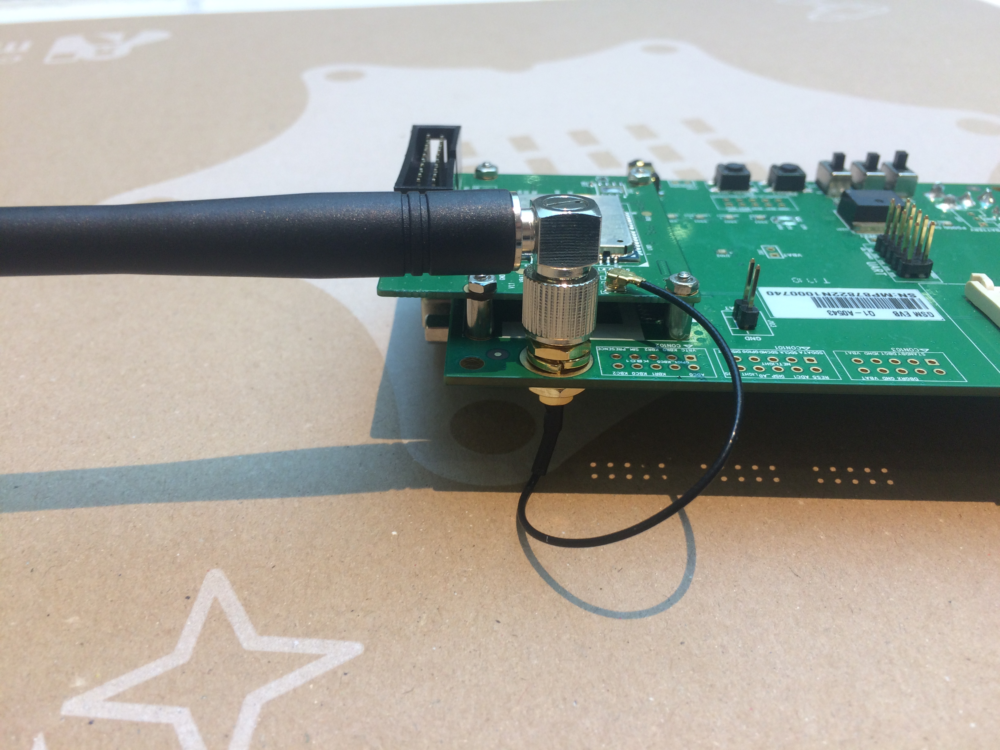

# Telekom NB-IoT Hackathon 2017

## Zusammenbau des Quectel-NB-IoT-Moduls

Dieses Dokument dient als Beschreibung für den Zusammenbau des Quectel NB-IoT Moduls, mit dessen Hilfe Daten übertragen werden können.

1. [Wichtige Komponenten](#wichtige-komponenten)
2. [Anschließen der Antenne](#anschließen-der-antenne)
3. [Fertiges Modul](#fertiges-modul)
4. [SIM-Karte](#sim-karte)

## Wichtige Komponenten

Packen Sie als erstes die beiden Leiterplatten und die Schrauben und Abstandshalter aus und legen Sie alles nebeneinander, wie auf dem Bild. (die Antenne und die großen Abstandshalter sind hier nicht abgebildet.)

Dazu gehören:
  - große Leiterplatte
  - kleine Leiterplatte
  - vier große Sechskant Abstandshalter
  - vier kleine runde Abstandshalter
  - vier Schrauben
  - acht Muttern

Nehmen Sie zunächst die große Leiterplatte und schrauben Sie die kleinen runden Abstandshalter mithilfe der kleinen Muttern von oben in den vergoldeten Löchern bei der weißen Markierung fest. (Als Orientierung: Sie finden diese bei dem Schriftzug UART3)

Stecken Sie nun die kleine Leiterplatte direkt über die Schrauben, sodass der Stecker mit den vielen kleinen Pins (Unterseite) fest mit der Buchsenleite (große Leiterplatte) verbunden ist. 
Schrauben Sie mit Hilfe der übrigen 4 kleinen Muttern die kleine Leiterplatte fest. 

Die großen (Sechskant) Abstanshalter ergeben die Füße für das Modul und werden an den äußeren vier Ecken der großen Leiterplatte mit der Richtung nach unten und den den beigelegten Schrauben befestigt.

Die beiden Leiterplatten sollten nun aussehen wie auf dem Bild [Fertiges Modul](#fertiges-modul).

## Anschließen der Antenne

Packen Sie nun die Antenne mit den erforderlichen Komonenten aus. 

Dazu gehören:
  - Antenne
  - Antennenkabel
  - Unterlegscheibe
  - Spannring
  - Mutter

Stecken Sie, wie auf dem oberen Bild dargestellt (Reihenfolge links nach rechts) zunächst die Unterlegscheibe auf die goldene Schraubbefestigung des Antennekabels und führen sie dieses anschließend von unten in die vorgesehene Öffnung auf der großen Leiterplatte.
Legen sie anschließend den Spannring drauf und schrauben die Befestigung mihilfe der Mutter fest. (diese darf auch etwas locker sein)
Schreuben Sie nun die Antenne auf die Befestigung. 

Dies sollte nun aussehen, wie auf dem folgenden Bild.

Nehmen Sie nun das lose Ende des Antennekabels uns schließen dieses durch vorsichtiges Aufdrücken an den Anschluss J101 auf der kleinen Leiterplatte an.

Dies sollte nun wie auf dem folgenden Bild aussehen.

## Fertiges Modul

Das fertige Modul sollte nun aussehen, wie auf dem folgenden Bild.

## SIM Karte

Die SIM- Karte erhalten Sie bei bei einem Mitarbeiter der Telekom. 

