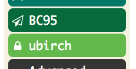

[](https://ubirch.com)

# Calliope mini development with MakeCode (PXT) Editor

1. [Online Editor](#online)
2. [Development](#develop-software-and-execute-it)
    1. [Install BC95 Editor Add-on](#install-the-ubirch-add-on-module-for-pxt)
    2. [Write code](#development)
        1. [Create Secret Key](#create-secret-key)
        2. [Register Device with Backend](#register-device-with-backend)
3. [Offline Editor Alternative](#offline-alternative)    

# Online 

The simplest way to start is using the online editor:

> [http://pxt.calliope.cc/index.html?lang=en](http://pxt.calliope.cc/index.html?lang=en)

# Develop Software and Execute it

## Install the ubirch add-on module for PXT

Bevor you can use the [BC95 module](http://www.quectel.com/product/bc95.htm) hardware module with the [ubirch](http://ubirch.com)
backend from PXT, you need to add a package to the online editor:

1. Click Add Package<br/> 
2. select `pxt-ubirch`<br/>
3. Now the block group `ubirch` appears together with `BC95` in your list<br/>

## Development

To start, [download the example project](https://raw.githubusercontent.com/ubirch/telekom-nbiot-hackathon-2017/master/ubirch-NB-IoT-Messaging.hex)
(right click and download as ...) and simply drag and drop it onto the online editor window:

>PXT works asynchronously, so you should not press the buttons in rapid succession as it will
>trigger the sending in parallel and may stop the modem from working. A reset recovers.


Der Javascript Code dazu sieht folgendermassen aus:

```typescript
input.onButtonPressed(Button.B, () => {
    bc95.send(
        ubirch.createStringMessage(
            "info",
            control.deviceName()
        )
    )
    if (!(bc95.sendOk())) {
        basic.showIcon(IconNames.Sad)
    }
})
input.onButtonPressed(Button.A, () => {
    bc95.send(
        ubirch.createNumberMessage(
            "temperature",
            input.temperature()
        )
    )
    if (!(bc95.sendOk())) {
        basic.showIcon(IconNames.Sad)
    }
})
ubirch.setSignKey("") // <-- YOU NEED TO ADD THE SECRET KEY HERE!
modem.enableDebug(true)
bc95.init(
    SerialPin.C17,
    SerialPin.C16,
    BaudRate.BaudRate9600
)
bc95.attach(
    6
)
bc95.setServer("13.93.47.253", 9090)
```

> After changing code: remember to download the program again and copy the resulting file onto the USB drive `MINI`. 

> Attention! Be aware that PXT does not support floating point math.

### Register Device with Backend

Identify the Calliope mini: download [deviceinfo.hex](https://raw.githubusercontent.com/ubirch/telekom-nbiot-hackathon-2017/master/deviceinfo.hex)
and copy it onto the Calliope mini. The ID will be shown as a HEX string on the display (i.e. `id:AB12CD34`).
Please go to the Backend-website [ubirch Demo](https://ubirch.demo.ubirch.com).


Please enter the login data provided.

Now you can add the device, you just have to enter the ID of the Calliope mini and a name for the device.


After switching to the tap 'devinfo' you can now do the setup to receive the data send from your Calliope mini.
There are 2 possibilities:

#### 1. Streaming API

To receive data continuously you can use the Streaming API.
You'll need [Mosquitto](https://mosquitto.org/download/) to access the MQTT-server.
To stream the data from your Calliope mini you have to subscribe the topic:

```
mosquitto_sub -h mq.demo.ubirch.com -p 1883 -t "ubirch-demo/ubirch/devices/$DEVICE_ID/processed" -u telekom -P SmartPublicLife2017`
```

Please replace `$DEVICE_ID` with the deviceID of your Calliope mini. You find it on the tab 'additional settings'. With this login you'll have read-only access to the MQTT-server.


The data received will now be displayed continuously.


#### 2. Query API

Requirement for the Query API is [curl](https://curl.haxx.se/download.html).

To get the data send, please enter the following commands:

```
DEVICEID=$DEVICE_ID
TOKEN=ya29.GlvGBNBxm5fa84UTyEi23JYSZ3E-OCOY8wVRAkmFaDwMfzCYtlc1TXuxBhnHLCNtIW26Z2yQGzO3EkPRsAIeWUeUEnzAfopy2f_FluXYl5Yp7OZyJjOnzEsxFmRk
HOST=https://api.ubirch.demo.ubirch.com

#last 10 datapoints
curl -XGET -H 'Authorization: Bearer $TOKEN' $HOST/api/avatarService/v1/device/$DEVICEID/data/history/0/10
```
> **Important:** Details for `HOST` and `TOKEN` can be found on the tab *dev info* on the detail page for your device.
> Please replace `$DEVICE_ID` with the deviceID of your Calliope mini. You find it on the tab 'additional settings'.
> 

### Create Secret Key (optional)
We recommend signing the data of your Calliope with an ECC key.

Use the script [ecc-generate.py](nbiot-cpp-template/ecc-generate.py) to create a new ECC key. The script requires the
device ID and will automatically register the public key with the backend. Copy
the private key string and setup your PXT program using `set sign key`.

The python-modules ed25519 and requests are required.

You can install them using [pip](https://pip.pypa.io/en/stable/installing/), a packetmanager 
for Python, by entering the following command:

```
pip install ed25519 requests
```

# Offline Alternative

An Alternative is to download the editor package and run it locally on a small web server. To
do that, an installation of [Node.js](https://nodejs.org/en/), or an existing local web server installation is necessary. 

- [download the editor package](https://github.com/calliope-mini/pxt-calliope-static/archive/master.zip)
- unpack `pxt-calliope-static-master.zip`
- download [Node.js](https://nodejs.org/en/)
- install the web server using this command line: `npm install -g http-server`

What's left is to run the web server. To do that, change into the unpacked directory `pxt-calliope-static-master` and
run the following command:

```
http-server -c-1 pxt-calliope-static/release
```

That's it. All that is left, is opening the following URL in your web browser:
[http://localhost:8080](http://localhost:8080).
