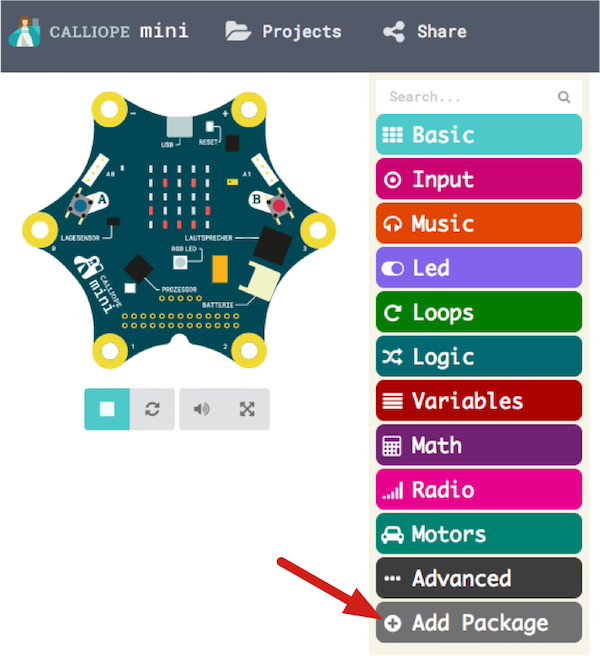
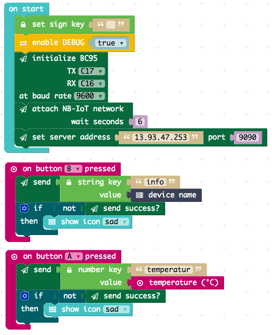

[](https://ubirch.com)

# Calliope mini development with MakeCode (PXT) Editor

1. [Online Editor](#online)
2. [Development](#develop-software-and-execute-it)
    1. [Install BC95 Editor Add-on](#install-the-bc95-add-on-module-for-pxt)
    2. [Write code](#development)
3. [Offline Editor Alternative](#offline-alternative)    

# Online 

The simplest way to start is using the online editor:

> [http://pxt.calliope.cc/index.html?lang=en](http://pxt.calliope.cc/index.html?lang=en)

# Develop Software and Execute it

## Install the BC95 add-on module for PXT

To use the [BC95 module](http://www.quectel.com/product/bc95.htm) hardware module from PXT, you need to add a package
to the online editor:

1. Click Add Package<br/> 
2. select `pxt-calliope-bc95`<br/>
3. Now the block group`BC95` appears in your list<br/>

## Development

To start, [download the example project](https://github.com/ubirch/telekom-nbiot-hackathon-2017/mini-EN-NB-IoT-Beispiel.hex)
and simply drag and drop it onto the online editor window:



Der Javascript Code dazu sieht folgendermassen aus:

```typescript
basic.forever(() => {
    bc95.sendNumber(
        "temperature",
        input.temperature()
    )
    bc95.sendNumber(
        "light",
        input.lightLevel()
    )
    basic.pause(10000)
})
bc95.init(
    SerialPin.C17,
    SerialPin.C16,
    BaudRate.BaudRate9600
)
bc95.attach(
    6
)
bc95.setServer("13.93.47.253", 9090)
```

> Remember to download the program again, after changing code and copy the resulting file onto the USB drive `MINI`. 

# Offline Alternative

An Alternative is to download the editor package and run it locally on a small web server. To
do that, an installation of [Node.js](https://nodejs.org/en/), or an existing local web server installation is necessary. 

- [download the editor package](https://github.com/calliope-mini/pxt-calliope-static/archive/master.zip)
- unpack `pxt-calliope-static-master.zip`
- download [Node.js](https://nodejs.org/en/)
- install the web server using this command line: `npm install -g http-server`

What's left is to run the web server. To do that, change into the unpacked directory `pxt-calliope-static-master` and
run the following command:

```
http-server -c-1 pxt-calliope-static/release
```

That's it. All that is left, is opening the following URL in your web browser:
[http://localhost:8080](http://localhost:8080).
