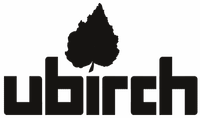

# Sensors

> This is a list of sensors available. Not all sensors have drivers provided. However, most sensors
> can be used directly via i2c, digital or analog pins. Bevor attaching a sensor, check
> that it works with 3.3v.

### Accelerometer/Compass (i2c, on-board)

- Typescript: (use PXT blocks)
- C++: (use `uBit.accelerometer.*`, `uBit.compass.*`)

> compass use initiates a calibration after a reset. Take Calliope mini (USB facing up) and turn it 360°.

### Thermometer (digital, on-board)

- Typescript: (use PXT blocks)
- C++: (use `uBit.thermometer.*`)

> influenced by chip temperature, usually a little too high

### Brightness (digital, on-board)

- Typescript: (use PXT blocks)
- C++: (use `uBit.display.getBrightness()`)

> uses the red LED display to sense light ([explanation](https://lancaster-university.github.io/microbit-docs/extras/light-sensing/))

### Microphone (analog, on-board)

- Typescript: [microphone.ts](typescript/microphone.ts)
- C++: (`uBit.io.P21.getAnalogValue()`, see typescript code)

### [Grove - Sound Sensor](http://wiki.seeed.cc/Grove-Sound_Sensor/) (analog, add-on)

- Typescript: [grove-sound-sensor.ts](typescript/grove-sound-sensor.ts)
- C++: (`uBit.io.XX.getAnalogValue()`, see typescript code)

### [Grove I2C Color Sensor](http://wiki.seeed.cc/Grove-I2C_Color_Sensor/) (i2c, add-on)

- Typescript: [grove-i2c-color-sensor.ts](typescript/grove-i2c-color-sensor.ts)
- C++: (use uBit.i2c, adapt from [mbed code](https://developer.mbed.org/users/HannesTschofenig/code/TCS34725/))

### ISL29125 Color Sensor

- Typescript: add package and select `isl29125` add-on
- C++: (adapt from [mbed](https://developer.mbed.org/components/ISL29125/))

### [Grove Temperature & Humidity Sensor](http://wiki.seeed.cc/Grove-TemptureAndHumidity_Sensor-High-Accuracy_AndMini-v1.0/) (i2c, add-on)

- Typescript: (no driver, use PXT i2c directly)
- C++: (adapt from [mbed](https://developer.mbed.org/teams/bazot-laurent/code/TH02_humidity_temp/) or [Arduino](https://github.com/Seeed-Studio/Grove_Temper_Humidity_TH02))

### [Grove - Barometer Sensor (BMP280)](http://wiki.seeed.cc/Grove-Barometer_Sensor-BMP280/) (i2c, add-on)

- Typescript: (no driver, use PXT i2c directly)
- C++ (adapt from [mbed](https://developer.mbed.org/users/MACRUM/code/BME280/))

### [Grove Temperature & Humidity Sensor Pro](http://wiki.seeed.cc/Grove-Temperature_and_Humidity_Sensor_Pro/) (analog, add-on)

- Typescript: (no driver, use `pins.analogReadPin(AnalogPin.XX)`)
- C++: (use `uBit.io.XX.getAnalogValue()`, adapt from [Arduino/Seeed](https://github.com/Seeed-Studio/Grove_Temperature_And_Humidity_Sensor))

> the sensor is a DHT22

### [Grove - IMU 9-axis sensor](http://wiki.seeed.cc/Grove-IMU_9DOF_v2.0/)

- Typescript: (no driver, use PXT i2c directly)
- C++: (adapt from [mbed](http://wiki.seeed.cc/Grove-IMU_9DOF_v2.0/) or [Arduino/Seeed](https://github.com/SeeedDocument/Grove-IMU_9DOF_v2.0))

### [Grove - 3-axis digital accelerometer (16g)](http://wiki.seeed.cc/Grove-3-Axis_Digital_Accelerometer-16g/) (i2c, add-on)

- Typescript: (no driver, use PXT i2c directly)
- C++: (adapt from [Arduino/Seeed](https://github.com/Seeed-Studio/Accelerometer_ADXL345))

### [Grove - Light Sensor](http://wiki.seeed.cc/Grove-Light_Sensor/) (analog, add-on)

- Typescript: [grove-ultrasonic-ranger.ts](typescript/grove-ultrasonic-ranger.ts) (use `pins.analogReadPin(AnalogPin.XX)`)
- C++: (use `uBit.io.XX.getAnalogValue()`)

### [Grove - IR Distance Interruptor v1.2](http://wiki.seeed.cc/Grove-IR_Distance_Interrupter_v1.2/) (digital, add-on)

- Typescript: [grove-ir-distance.ts](typescript/grove-ir-distance.ts)
- C++: (use `uBit.io.XX.getDigitalValue()`)

### [Grove - Ultrasonic Ranger](http://wiki.seeed.cc/Grove-Ultrasonic_Ranger/) (digital, add-on)

- Typescript: [grove-ultrasonic-ranger.ts](typescript/grove-ultrasonic-ranger.ts) (use `pins.digitalReadPin(DigitalPin.XX)`)
- C++: (use `uBit.io.XX.getDigitalValue()`)

> Seeed provides a PXT add-on: Add Package and select Grove!
> didn't correctly sense range, may be due to typescript inaccuracy or timing issues

### [Grove UV Sensor](http://wiki.seeed.cc/Grove-UV_Sensor/) (analog, add-on)

- Typescript: (no driver, use `pins.analogReadPin(AnalogPin.XX)`)
- C++: (`uBit.io.XX.getAnalogValue()`, see typescript code)

> the sensor didn't work as expected, the calculation from Seeed may need to be adjusted

### [Grove PIR Motion Sensor](http://wiki.seeed.cc/Grove-PIR_Motion_Sensor/) (digital, add-on)

- Typescript: (no driver, use `pins.digitalReadPin(DigitalPin.XX)`)
- C++: (use `uBit.io.XX.getDigitalValue()`)

> the sensor didn't work as expected

### [Grove Dust Sensor](http://wiki.seeed.cc/Grove-Dust_Sensor/) (digital, add-on)

> untested
### Hall Sensor (analog/digital, add-on)

> untested

### [GPS Modul](https://www.seeedstudio.com/Xadow-GPS-v2-p-2557.html) (Xadow GPS v2 with I2C)

> untested

